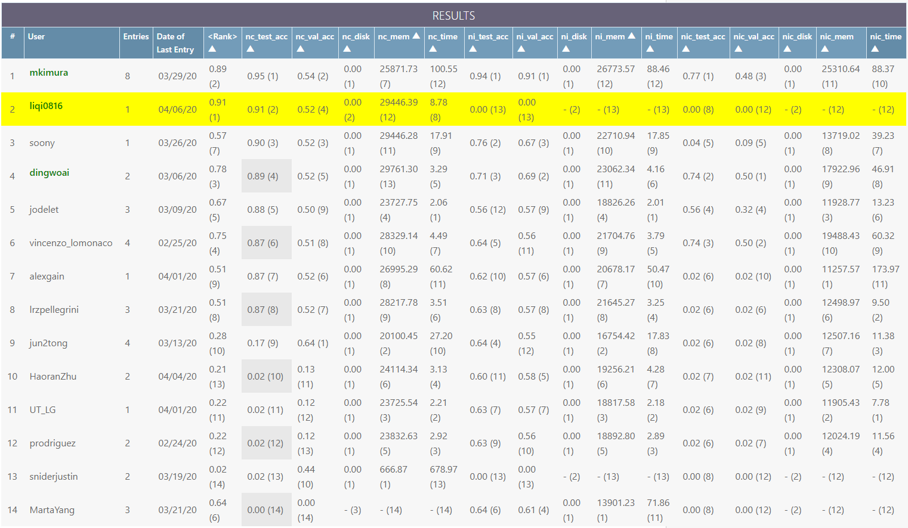

# [Full Course Project Report](README.assets/AI_Project2_Report.pdf)

Please see [README.assets/AI_Project2_Report.pdf](README.assets/AI_Project2_Report.pdf).

# Summary

We followed the idea from *[Overcoming catastrophic forgetting in neural networks (EWC)](https://arxiv.org/abs/1612.00796)* and conducted experiments on MNIST and CORe50 datasets. Results showed that our model beat the ResNet-18 baseline by 2% on CORe50. On the official [CLVision challenge leaderboard](https://competitions.codalab.org/competitions/23317#results) we scored a `nc_test_acc` of 0.91.



# Theory

In brains, synaptic consolidation enables continual learning by reducing the plasticity of synapses that are vital to previously learned tasks. We implement an algorithm that performs a similar operation in artificial neural networks by constraining important parameters to stay close to their old values. 

Suppose we have two sequentially happened tasks  and . While learning task , EWC will protect the performance in task  by constraining the parameters to stay in a region of low error for task .

From a probabilistic perspective: optimizing the parameters is tantamount to finding their most probable values given some data . We can compute this conditional probability )  from the prior probability of the parameters ) and the probability of the data ) by using Bayes’ rule:

%20%3D%20%5Clog%20%5CPr(D%7C%5Ctheta)%20%2B%20%5Clog%20%5CPr(%5Ctheta)%20-%20%5Clog%20%5CPr(D))

Here is applying Bayes’ rule on two following tasks  & 

%20%3D%20%5Clog%20%5CPr(D_B%7C%5Ctheta)%20%2B%20%5Clog%20%5CPr(%5Ctheta%7CD_A)%20-%20%5Clog%20%5CPr(D_B))

): All the information about task A must therefore have been absorbed into the posterior distribution ).

we approximate the posterior as a Gaussian distribution with mean given by the parameters  and a diagonal precision given by the diagonal of the Fisher information matrix .

The function L that we minimize in EWC is:

%20%3D%20L_%7BB%7D%20(%5Ctheta%20)%20%2B%20%5Csum_%7Bi%7D%5E%7Bn%7D%20%5Cfrac%7B%5Clambda%20%7D%7B2%7D%20F_%7Bi%7D%20(%5Ctheta%20_%7Bi%7D%20-%20%5Ctheta%20_%7BA%2Ci%7D%5E%7B*%7D)%5E%7B2%7D)

This picture shows the ideal goal of  EWC:


# Implementation and Experiment

The CORe50 dataset is a resource demanding one and cannot fit in a regular personal computer. Therefore, we employed a google cloud compute engine with 8 vCPU, 54GB RAM and an Nvidia T4 GPU to carry out this part of the experiment. The implementation used the Torch framework, and source code can be found [online](https://github.com/liqi0816/6613-proj2). 

We used the image preprocessing part in starter pack as-is. The preprocessing function serves to satisfy requirements assumed by [torchvision pretrained models](https://pytorch.org/docs/stable/torchvision/models.html). It pads mini-batches of images to at least 224x224 pixels, normalizes images with `mean = [0.485, 0.456, 0.406]` and `std = [0.229, 0.224, 0.225]`. At the end it also shuffles the batch.

The base model is namely ResNet-18, pre-trained by pytorch. It is the most basic ResNet structure, with 17 convolutional layers and 1 fully connected layer. Experiments showed that the baseline model from CVPR competition starter pack could already achieve an accuracy of 1.0 within each subtask. For a better comparison, we kept the same base model, on the top of which added EWC mechanism. The EWC module is shared between MINST experiment and CORe50 experiment.


We trained the network with the data loader bundled in the starter pack. The loader will split 50 classes into 9 tasks/batches, and feed them into the network successively. A portion of the dataset will become validation set, and the same validation set is kept between tasks. 

There are two major hyper-parameter in our model, `ewc_explosion_multr_cap`, which controls how smooth EWC loss should be, and `ewc_weight`, which controls how important EWC loss is. In experiment We frequently observe gradient explosion and loss going to `NaN`. We borrowed the idea of gradient clipping, setting a maximum for EWC loss. To further smoothen the loss curve, we use $\arctan$ as the clipping function. We empirically chose `ewc_explosion_multr_cap` between 5-25 and `ewc_weight` between 5-5000 in our experiment.

The experiment results are shown in the following two figures:


(due to limitation on computation resources, some cells may contain 0 which indicates missing experiment)

As shown above, the best result is obtained with `ewc_explosion_multr_cap=15` and `ewc_weight=50`. The full experiment log is attached in appendix. The final result is

```
------------------------------------------
Avg. acc: [0.9471604938271605]
------------------------------------------
Training Time: 7.673416260878245m
Average Accuracy Over Time on the Validation Set: 0.5267215363511659
Total Training/Test time: 7.673416260878245 Minutes
Average RAM Usage: 21473.329210069445 MB
Max RAM Usage: 29456.984375 MB
Experiment completed.
```

Note that while "`Avg. acc:`" is actually the final accuracy averaged *over all classes* after all tasks/batches.

The baseline result is

```
------------------------------------------
Avg. acc: [0.922716049382716]
------------------------------------------
Training Time: 7.656683707237244m
Average Accuracy Over Time on the Validation Set: 0.5145679012345679
Total Training/Test time: 7.656683707237244 Minutes
Average RAM Usage: 21424.665364583332 MB
Max RAM Usage: 29409.3671875 MB
Experiment completed.
```

which shows that our model performs 2% better after *all* tasks/batches.

# Technical Information

## Setup

```bash
sh fetch_data_and_setup.sh
conda env create -f environment.yml
conda activate clvision-challenge
```

## Run

```bash
python main_ewc.py  --sub_dir=<sub_dir> [ --epochs=EPOCH ] [ --ewc_weight=EWC_WEIGHT ] [ --ewc_explosion_multr_cap=EWC_EXPLOSION_MULTR_CAP ]
```

# Appendix

## full experiment log

```
+ python main_ewc.py --scenario=multi-task-nc --epochs=2 --sub_dir=ewc-50-15-04051747 --ewc_weight=50 --ewc_explosion_multr_cap=15
Namespace(batch_size=32, classifier='ResNet18Ewc', cuda=True, device='cuda:0', epochs=2, ewc_explosion_multr_cap=15, ewc_weight=50, input_size=[3, 128, 128], lr=0.01, n_classes=50, preload_data=True, replay_examples=0, scenario='multi-task-nc', sub_dir='ewc-50-15-04051747')

Loading data...
Loading paths...
Loading LUP...
Loading labels...
preparing CL benchmark...
Recovering validation set...
----------- batch 0 -------------
x shape: (23980, 128, 128, 3), y shape: (23980,)
Task Label:  0
training ep:  0
==>>> it: 0, avg. loss: 0.135992, running train acc: 0.000
==>>> it: 100, avg. loss: 0.000080, running train acc: 0.853
==>>> it: 200, avg. loss: 0.000004, running train acc: 0.919
==>>> it: 300, avg. loss: 0.000005, running train acc: 0.944
==>>> it: 400, avg. loss: 0.000001, running train acc: 0.957
==>>> it: 500, avg. loss: 0.000006, running train acc: 0.965
==>>> it: 600, avg. loss: 0.000002, running train acc: 0.970
==>>> it: 700, avg. loss: 0.000000, running train acc: 0.974
training ep:  1
==>>> it: 0, avg. loss: 0.000064, running train acc: 1.000
==>>> it: 100, avg. loss: 0.000004, running train acc: 1.000
==>>> it: 200, avg. loss: 0.000001, running train acc: 1.000
==>>> it: 300, avg. loss: 0.000000, running train acc: 1.000
==>>> it: 400, avg. loss: 0.000000, running train acc: 1.000
==>>> it: 500, avg. loss: 0.000000, running train acc: 1.000
==>>> it: 600, avg. loss: 0.000000, running train acc: 1.000
==>>> it: 700, avg. loss: 0.000000, running train acc: 1.000
------------------------------------------
Avg. acc: [0.10592592592592592]
------------------------------------------
----------- batch 1 -------------
x shape: (11993, 128, 128, 3), y shape: (11993,)
Task Label:  1
training ep:  0
==>>> it: 0, avg. loss: 2.294219, running train acc: 0.000
==>>> it: 100, avg. loss: 0.011754, running train acc: 0.929
==>>> it: 200, avg. loss: 0.001855, running train acc: 0.963
==>>> it: 300, avg. loss: 0.006157, running train acc: 0.974
training ep:  1
==>>> it: 0, avg. loss: 0.002625, running train acc: 1.000
==>>> it: 100, avg. loss: 0.000001, running train acc: 1.000
==>>> it: 200, avg. loss: 0.000000, running train acc: 1.000
==>>> it: 300, avg. loss: 0.000000, running train acc: 1.000
------------------------------------------
Avg. acc: [0.2111111111111111]
------------------------------------------
----------- batch 2 -------------
x shape: (11990, 128, 128, 3), y shape: (11990,)
Task Label:  2
training ep:  0
==>>> it: 0, avg. loss: 2.477970, running train acc: 0.000
==>>> it: 100, avg. loss: 0.002698, running train acc: 0.909
==>>> it: 200, avg. loss: 0.016435, running train acc: 0.951
==>>> it: 300, avg. loss: 0.000676, running train acc: 0.966
training ep:  1
==>>> it: 0, avg. loss: 0.001833, running train acc: 1.000
==>>> it: 100, avg. loss: 0.000002, running train acc: 1.000
==>>> it: 200, avg. loss: 0.000000, running train acc: 1.000
==>>> it: 300, avg. loss: 0.000000, running train acc: 1.000
------------------------------------------
Avg. acc: [0.3182716049382716]
------------------------------------------
----------- batch 3 -------------
x shape: (11993, 128, 128, 3), y shape: (11993,)
Task Label:  3
training ep:  0
==>>> it: 0, avg. loss: 2.520876, running train acc: 0.000
==>>> it: 100, avg. loss: 0.035447, running train acc: 0.921
==>>> it: 200, avg. loss: 0.017379, running train acc: 0.958
==>>> it: 300, avg. loss: 0.012170, running train acc: 0.971
training ep:  1
==>>> it: 0, avg. loss: 0.003426, running train acc: 1.000
==>>> it: 100, avg. loss: 0.000272, running train acc: 1.000
==>>> it: 200, avg. loss: 0.000146, running train acc: 1.000
==>>> it: 300, avg. loss: 0.000098, running train acc: 1.000
------------------------------------------
Avg. acc: [0.42271604938271606]
------------------------------------------
----------- batch 4 -------------
x shape: (11989, 128, 128, 3), y shape: (11989,)
Task Label:  4
training ep:  0
==>>> it: 0, avg. loss: 2.571689, running train acc: 0.000
==>>> it: 100, avg. loss: 0.050104, running train acc: 0.875
==>>> it: 200, avg. loss: 0.025303, running train acc: 0.931
==>>> it: 300, avg. loss: 0.017094, running train acc: 0.953
training ep:  1
==>>> it: 0, avg. loss: 0.008195, running train acc: 1.000
==>>> it: 100, avg. loss: 0.000486, running train acc: 0.998
==>>> it: 200, avg. loss: 0.000243, running train acc: 0.999
==>>> it: 300, avg. loss: 0.000163, running train acc: 0.999
------------------------------------------
Avg. acc: [0.5288888888888889]
------------------------------------------
----------- batch 5 -------------
x shape: (11979, 128, 128, 3), y shape: (11979,)
Task Label:  5
training ep:  0
==>>> it: 0, avg. loss: 2.581709, running train acc: 0.000
==>>> it: 100, avg. loss: 0.033580, running train acc: 0.877
==>>> it: 200, avg. loss: 0.016457, running train acc: 0.933
==>>> it: 300, avg. loss: 0.011057, running train acc: 0.954
training ep:  1
==>>> it: 0, avg. loss: 0.002460, running train acc: 1.000
==>>> it: 100, avg. loss: 0.000458, running train acc: 0.999
==>>> it: 200, avg. loss: 0.000177, running train acc: 1.000
==>>> it: 300, avg. loss: 0.000001, running train acc: 1.000
------------------------------------------
Avg. acc: [0.6333333333333333]
------------------------------------------
----------- batch 6 -------------
x shape: (11990, 128, 128, 3), y shape: (11990,)
Task Label:  6
training ep:  0
==>>> it: 0, avg. loss: 2.616510, running train acc: 0.000
==>>> it: 100, avg. loss: 0.044084, running train acc: 0.894
==>>> it: 200, avg. loss: 0.022818, running train acc: 0.944
==>>> it: 300, avg. loss: 0.015321, running train acc: 0.962
training ep:  1
==>>> it: 0, avg. loss: 0.007398, running train acc: 1.000
==>>> it: 100, avg. loss: 0.000001, running train acc: 1.000
==>>> it: 200, avg. loss: 0.000000, running train acc: 1.000
==>>> it: 300, avg. loss: 0.000000, running train acc: 1.000
------------------------------------------
Avg. acc: [0.7434567901234568]
------------------------------------------
----------- batch 7 -------------
x shape: (11987, 128, 128, 3), y shape: (11987,)
Task Label:  7
training ep:  0
==>>> it: 0, avg. loss: 2.665057, running train acc: 0.000
==>>> it: 100, avg. loss: 0.029730, running train acc: 0.899
==>>> it: 200, avg. loss: 0.016811, running train acc: 0.948
==>>> it: 300, avg. loss: 0.008023, running train acc: 0.965
training ep:  1
==>>> it: 0, avg. loss: 0.002280, running train acc: 1.000
==>>> it: 100, avg. loss: 0.000172, running train acc: 1.000
==>>> it: 200, avg. loss: 0.000086, running train acc: 1.000
==>>> it: 300, avg. loss: 0.000058, running train acc: 1.000
------------------------------------------
Avg. acc: [0.8296296296296296]
------------------------------------------
----------- batch 8 -------------
x shape: (11993, 128, 128, 3), y shape: (11993,)
Task Label:  8
training ep:  0
==>>> it: 0, avg. loss: 2.607437, running train acc: 0.000
==>>> it: 100, avg. loss: 0.005643, running train acc: 0.894
==>>> it: 200, avg. loss: 0.022239, running train acc: 0.945
==>>> it: 300, avg. loss: 0.015052, running train acc: 0.963
training ep:  1
==>>> it: 0, avg. loss: 0.002645, running train acc: 1.000
==>>> it: 100, avg. loss: 0.000135, running train acc: 1.000
==>>> it: 200, avg. loss: 0.000068, running train acc: 1.000
==>>> it: 300, avg. loss: 0.000045, running train acc: 1.000
------------------------------------------
Avg. acc: [0.9471604938271605]
------------------------------------------
Training Time: 7.673416260878245m
Average Accuracy Over Time on the Validation Set: 0.5267215363511659
Total Training/Test time: 7.673416260878245 Minutes
Average RAM Usage: 21473.329210069445 MB
Max RAM Usage: 29456.984375 MB
Experiment completed.
```
